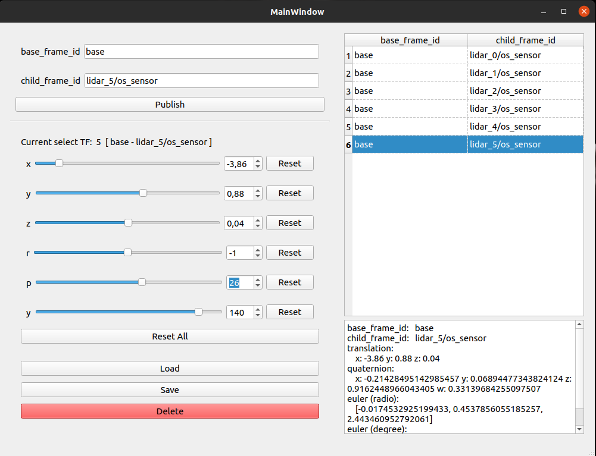

# tf_publisher_gui for ROS

## Introduction



## How to use

```shell
cd catkin_ws/src
git clone https://github.com/yinwu33/tf_publisher_gui.git
cd catkin_ws
catkin_make
source devel/setup.bash

rosrun tf_publisher_gui run.py
```

## Dependencies

* PyQt5
* tf2_ros
* tf
